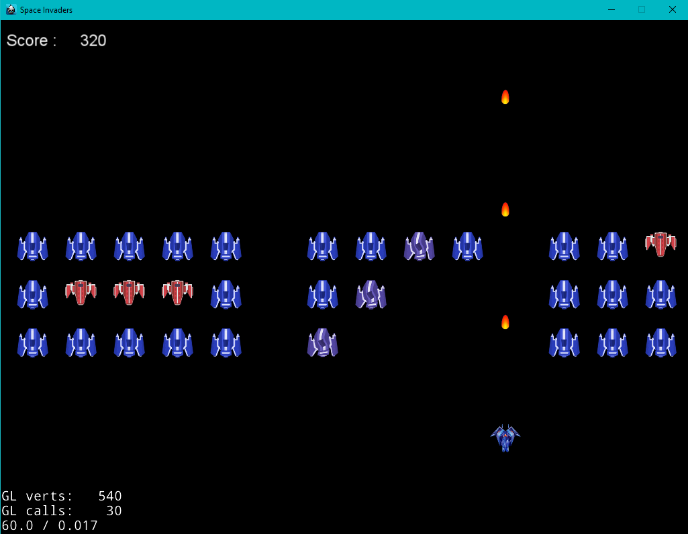

# Space Invaders game focussed on Design Pattern
cocos2d-x is a multi-platfrom framework building 2d games.

This project is focussed on Game Design Pattern.

It uses following concepts.
* SOLID principle
* Object Pool
* Factory

[See video here.](https://www.loom.com/share/e3bb912db3f54958ba86332ce3ea257b)



## Starting guide

### Building Envirionment

#### Windows installation

download and install following.

cocos2d-x 4.0(http://cocos2d-x.org/filedown/cocos2d-x-v4.0)

python 2.7(https://www.python.org/download/releases/2.7/)

cmake(https://cmake.org/download/)

visual studio 2017

``` bash
cd path/to/cocos2d-x
python setup.py
```

### Running the code
If you are new to `cocos2d-x` I recommend following this [article](https://www.raywenderlich.com/1848-cocos2d-x-tutorial-for-beginners) for the first time.<br/>

``` bash
cocos new -l cpp -d /path/to/project/dir SpaceInvaders
git clone https://github.com/triaton/space-invaders.git SpaceInvaders_temp
```
Copy all files and directories in `SpaceInvaders_temp` to `SpaceInvaders`.<br/>
(If you want to continue with my git history, be sure to copy hidden `.git` directory as well.) <br/>
Run the following in the command prompt.
``` bash
cd SpaceInvaders
cocos run . -p win32
```
The above building process may vary depending on platforms.<br/>
`cocos --help` for more details.
